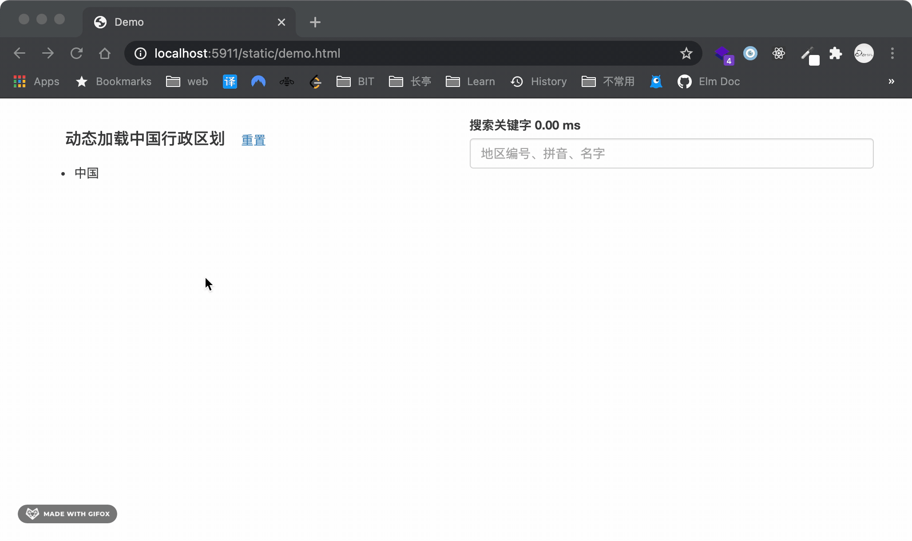
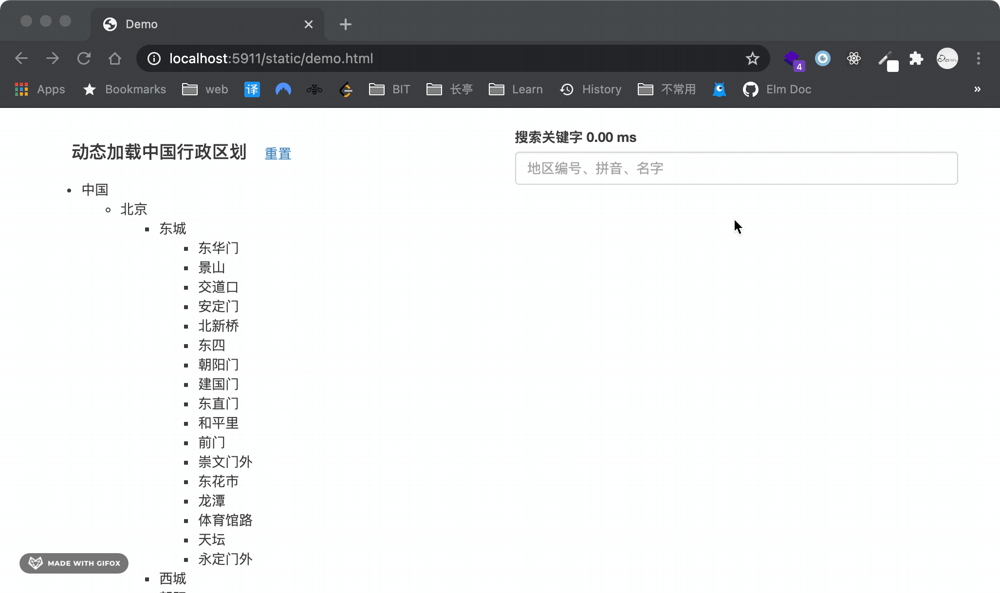

# 中国行政区划微服务（GB2260）

## 目标

提供统一标准的（GB2260）中国行政区划数据。包括省、市、区县、村镇的名称、拼音、编号、地理坐标信息。

1. 统一行行政区划数据，地区名称和地区编号均采用国标，并在国家行政区划发生变化时，支持不同版本。
2. 提供统一接口，同时面向其它服务（前端、后端）提供统一接口。
3. 其它快捷功能，地区层级关系、模糊搜索等。

## 启动服务

-   本地服务模式

```shell
git clone --depth=1 https://github.com/NetworkSecurityVision/GB2260.git
cd GB2260
pip3 install -r requirements.txt
python3 app.py
```

-   docker 服务模式

```shell
docker run -p 5911:5911 delongw/gb2260
```

功能演示

然后使用浏览器访问 http://localhost:5911/static/demo.html

区域浏览（懒加载）



模糊搜索，编号、名字、拼音



## 生成数据

查看 /datasource/README.md

## 技术方案

-   Python https://www.python.org/
-   Sanic https://sanicframework.org/
-   Sqlite3 https://www.sqlite.org/index.html
    -   fuzzy search https://www.sqlite.org/fts3.html
-   Docker https://docker.com/

行政区划数据采用加载文件到内存方式，模糊搜索使用 Sqlite3 的 fts4 方案。

## 数据源

感谢 Github 开源项目的数据整理，当前使用数据源来自以下项目

-   https://github.com/modood/Administrative-divisions-of-China
-   https://github.com/xiangyuecn/AreaCity-JsSpider-StatsGov

行政区划标准说明

中国行政区划由**民政部**负责维护、更新（惯例上会每年发布一次），
目前最新版是 2020 年第七次人口普查期间使用的版本，
数据格式采用 GB/T 2260 标准，每一个行政区划都有自己的唯一编号（[编号含义](http://www.stats.gov.cn/tjsj/tjbz/200911/t20091125_8667.html)）。

## API

### 行政地区详情

请求地址

    GET /china/division/2020/:code?children=<bool>&location=<bool>

参数

| 参数     | 必填 | 默认  | 用途                                               |
| -------- | ---- | ----- | -------------------------------------------------- |
| code     | 是   | <无>  | 地区编号，中国编号是 0，从 0 开始检索              |
| location | 否   | false | 返回数据是否附带地理位置信息（部分地区无坐标数据） |
| children | 否   | false | 返回数据是否附带子区域数据                         |

返回数据

```json
{
    "code": "<string>", // 地区编码
    "name": "<string>", // 地区名称
    "fullpath": "<string>", // 地区完整路径名称
    "location": {
        // 坐标信息
        "latitide": "<float>", // 纬度
        "longitude": "<float>", // 经度
        "type": "GCJ02" // 坐标系标准，目前采用的 GCJ02 标准
    },
    "children": [
        // 子区域信息，如果没有子区域则是空数组
        {
            "code": "<string>", // 地区编码
            "name": "<string>" // 地区名称
        }
    ]
}
```

访问示例

-   地区信息

http://localhost:5911/china/division/2020/11

```json
{
    "code": "11",
    "name": "北京市",
    "fullpath": "北京市"
}
```

-   地区信息，含坐标

http://localhost:5911/china/division/2020/11?location=true

```json
{
    "code": "11",
    "name": "北京市",
    "location": {
        "latitude": 39.904989,
        "longitude": 116.405285,
        "type": "GCJ02"
    },
    "fullpath": "北京市"
}
```

-   地区信息，含坐标，含子区域

http://localhost:5911/china/division/2020/1101?location=true&children=true

```json
{
    "code": "1101",
    "name": "市辖区",
    "location": {
        "latitude": 39.904989,
        "longitude": 116.405285,
        "type": "GCJ02"
    },
    "fullpath": "北京市 市辖区",
    "children": [
        {
            "code": "110101",
            "name": "东城区"
        },
        {
            "code": "110102",
            "name": "西城区"
        } // ...more
    ]
}
```

### 模糊搜索

请求地址

    GET /china/division/2020/fuzzy?k=<string>&size=<int>

参数说明

| 参数 | 必填 | 默认 | 用途                                      |
| ---- | ---- | ---- | ----------------------------------------- |
| k    | 是   | <无> | 搜索关键词，可以搜索地区 编号、名字、拼音 |
| size | 否   | 5    | 返回数据条目最大数量                      |

返回数据

```json
[
    {
        "code": "<string>", // 地区编号
        "name": "<string>", // 地区名称
        "fullpath": "<string>" // 地区完整路径
    },
    ...
]
```

访问示例

http://localhost:5911/china/division/2020/fuzzy?k=1&size=3

```json
[
    {
        "code": "11",
        "name": "北京市",
        "fullpath": "北京市"
    },
    {
        "code": "12",
        "name": "天津市",
        "fullpath": "天津市"
    },
    {
        "code": "13",
        "name": "河北省",
        "fullpath": "河北省"
    }
]
```

## TODO

-   [x] 增加港澳台简单数据
-   [ ] 单元测试
-   [ ] 性能测试
-   [ ] 更多配置参数
-   [ ] 补充数据细节
-   [ ] 年一个更新的斑斑

## Docker

```shell
export v=0.2
docker build a .
docker tag a:latest delongw/gb2260:$v
docker push delongw/gb2260:$v
docker tag a:latest delongw/gb2260:latest
docker push delongw/gb2260:latest
```
